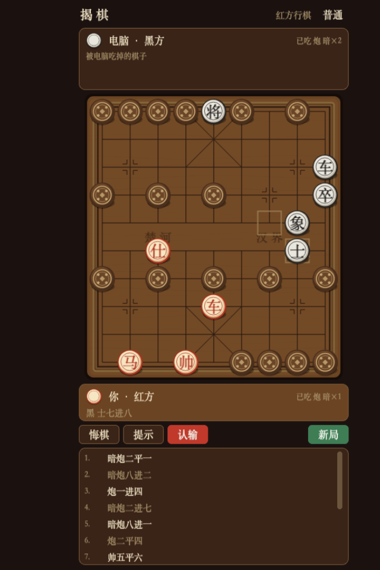

# 揭棋 · JieQi

> 用 **Phaser 4 + phaser-mvvm** 写的**揭棋**（中国象棋变种）人机对战游戏。竖屏手机画面、
> 中国古风，通过 **Cordova** 打包成签名的 Android APK。



揭棋的趣味在于**你连自己的子是什么都不知道**：开局除将帅外全部背面朝上随机摆放，走到哪一步
才知道翻出来的是什么。所以这里的 AI 不是普通的象棋 AI —— 它必须在一个**信息集**上做决策。

## 快速开始

```bash
pnpm install
pnpm dev                          # http://127.0.0.1:5180
pnpm test                         # 69 条规则、AI、吃子提示与托盘单测
./build-android-release.sh        # 签名 release APK（见「Android 打包」）
```

## 特性

- **完整揭棋规则**（R1–R13）：暗子按格位走子、暗仕/士不出九宫、明相/仕可过河、暗子被吃不翻开
- **禁止全局同形**：任何一方不得让局面回到本局出现过的样子；全堵死时按**困毙判负**
- **信息集 AI**：PIMC（完全信息蒙特卡洛）搜索，带一丝可复现的随机性
- **吃子提示**（红/绿光圈）与**送将提示**
- **定先后抽子动画**：棋子正反面决定执红/执黑，执黑时棋盘镜像
- **BGM 状态管理** + 14 个音效、霞鹜文楷字体、纯代码绘制的古风美术

## 技术栈

Phaser 4 · TypeScript · phaser-mvvm · Vite · Vitest · Cordova (Android)

```
src/core   规则引擎（零 Phaser、零 DOM，纯 Node 可单测）
src/ai     PIMC 评估与搜索
src/ui     程序化贴图 · 棋子/棋盘视图 · 动画库
src/vm     ViewModel · 本地偏好 · 被吃子托盘规则
src/scenes Boot → Start → Draw（定先后）→ Game
src/debug  验收后门 window.__JIEQI__
```

## Android 打包

```bash
./build-android-release.sh            # 签名 release APK
./build-android-release.sh --debug    # 未签名 debug APK
./build-android-release.sh --skip-web # 复用已有 dist/
```

> ⚠️ **versionCode 每次要手动 +1**（`JIEQI_VERSION_CODE=N ./build-android-release.sh`）。
> 脚本默认 1，Android 拒绝安装 versionCode 更低的包，且失败看起来完全不像构建失败。
>
> ⚠️ **密钥库与口令是提交进仓库的**（一条命令出包，适合演示）；正式发布请自行生成密钥库、
> 移出版本控制，改用环境变量传凭据（`JIEQI_KEYSTORE` 等）。

## 文档

- [docs/DESIGN.md](docs/DESIGN.md) — 规则基线（含与 Pikafish 揭棋分支的交叉印证）、AI 设计、架构、美术与已知边界
- [docs/ACCEPTANCE.md](docs/ACCEPTANCE.md) — 每版验收记录（命令、读数、修掉的缺陷）
- [CHANGELOG.md](CHANGELOG.md) — 版本历史

## 已知边界（简）

- **背景音乐与音效的授权无法在本仓库内核实**，对外发布前请自行确认两处素材的使用许可
  （来源见 `scripts/build-audio.sh`）。
- **Android 产物未在真机/模拟器上安装过**：构建链路已跑通并验证签名，但"在手机上跑起来没问题"
  尚无实机证据。
- 完整边界清单（含每步搜索同步阻塞、PIMC 策略融合近似、字体体积权衡）见
  [docs/DESIGN.md](docs/DESIGN.md) §8。

## 许可

MIT（见 [LICENSE](LICENSE)）。`vendor/phaser-mvvm/` 是 [phaser-mvvm](https://github.com/universe-st/phaser-mvvm)
（MIT, © universe-st）的源码副本，许可证一并带上。`phaser` 作为 peer dependency 从 npm 引入（MIT）。
